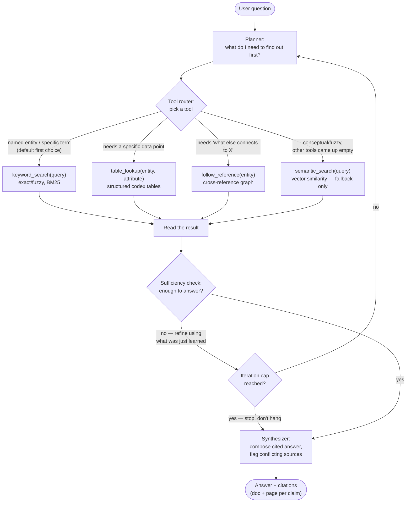

# Agent decision loop

The core of the product (see `docs/decisions.md` → "Tool-first agent, not
vector-RAG-first"): the agent doesn't run a fixed number of retrieval
passes, it decides after every result whether to answer or search again,
capped so a live demo can never hang.

## Flow

## Why this shape, not top-k retrieval

- Each loop iteration is informed by what the *previous* result actually
  said — the planner can follow a cross-reference it just discovered, or
  re-query more narrowly after a keyword search returns too much.
- The tool choice is itself a decision, not "always embed and search":
  `semantic_search` is explicitly the last resort, used only when the
  question is genuinely conceptual or the structured tools found nothing.
- The iteration cap (see `docs/limitations.md`) exists purely for demo
  safety — a question that needs more hops than the cap gets a best-effort
  partial answer instead of the process hanging live in front of judges.
