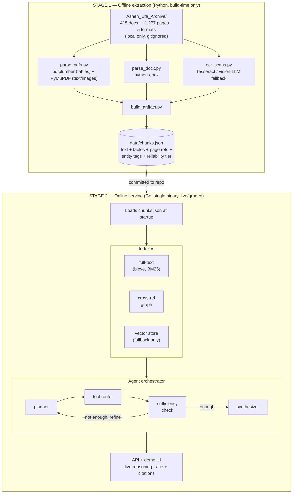

# System architecture diagram

Two stages, split at the extraction/serving seam — see
[`docs/architecture.md`](../architecture.md) for the full explanation and
[`docs/decisions.md`](../decisions.md) for why the split exists.

## Notes

- The dashed arrow is the only thing that crosses the stage boundary:
  a single committed JSON file, not a live dependency.
- `vec` (vector store) is drawn inside the indexes but is only ever queried
  by the `semantic_search` tool as a fallback — see
  [`agent-loop.md`](agent-loop.md) for how the agent decides when to use it.
